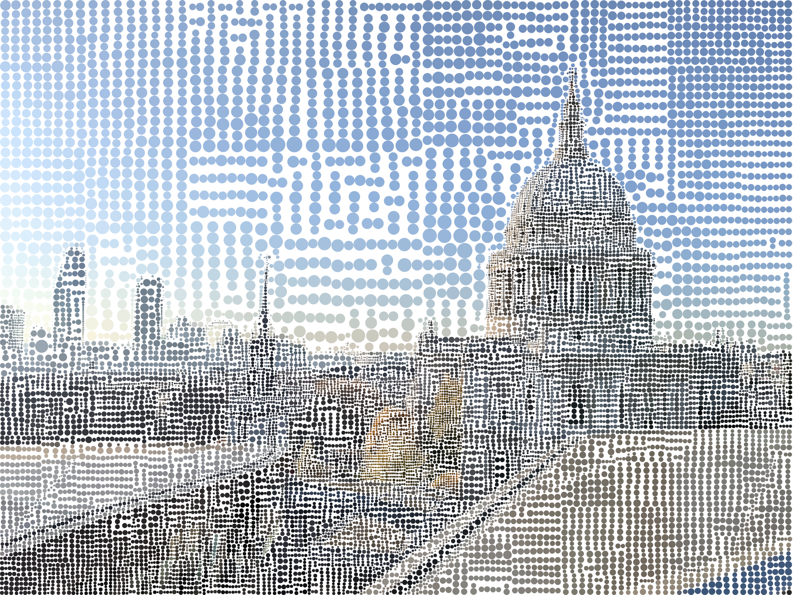
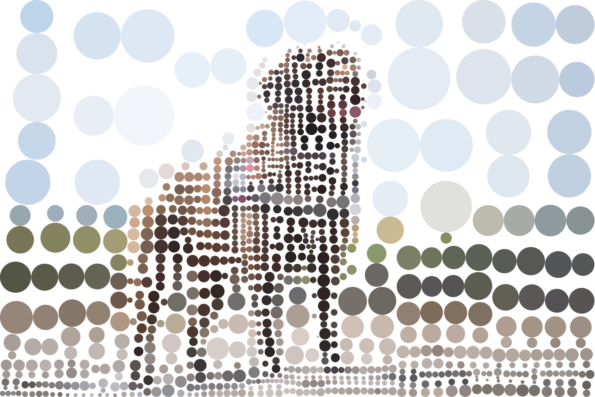

# PixelShapes
Using a target image, generate an art piece comprised of a series of carefully-placed chosen shapes of various sizes.

## Installation
In a virtual environment (recommended) or otherwise, install the dependencies.
```bash
pip install -r requirements.txt
```

## Usage
```
usage: main.py [-h] [-d] [-r] [-bg BACKGROUND] input shape iterations output

positional arguments:
  input                 Path to input image
  shape                 Path to svg shape
  iterations            Number of iterations to run median cut for
  output                Path to save result image to

optional arguments:
  -h, --help            show this help message and exit
  -d, --debug           Show debug popup
  -r, --rasterize       Rasterize the vector graphics to png
  -bg BACKGROUND, --background BACKGROUND
                        SVG colour for the background. Transparent by default
```

## Examples




